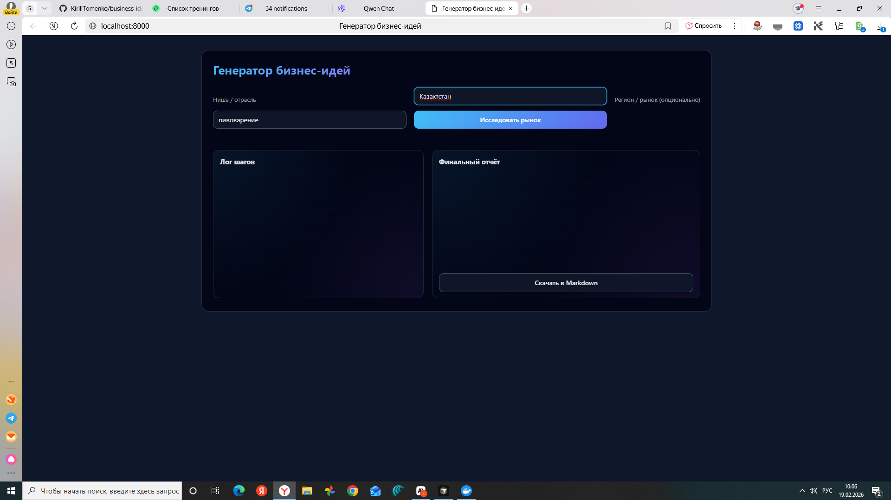
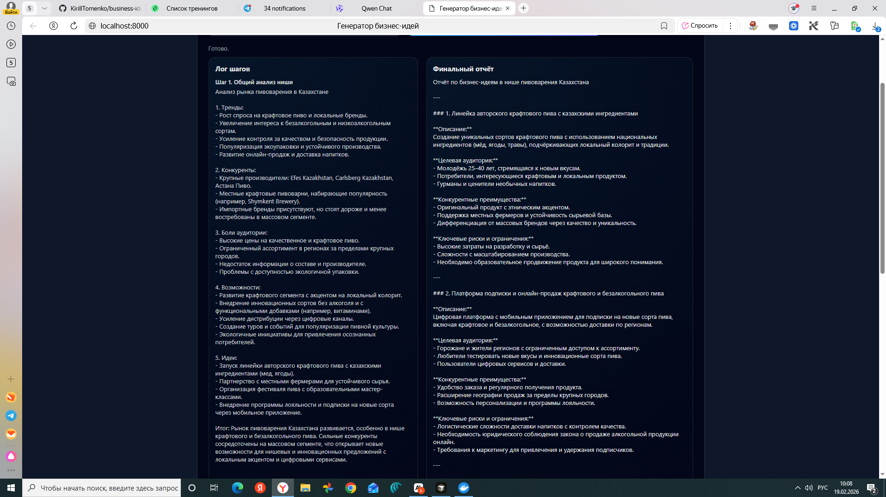
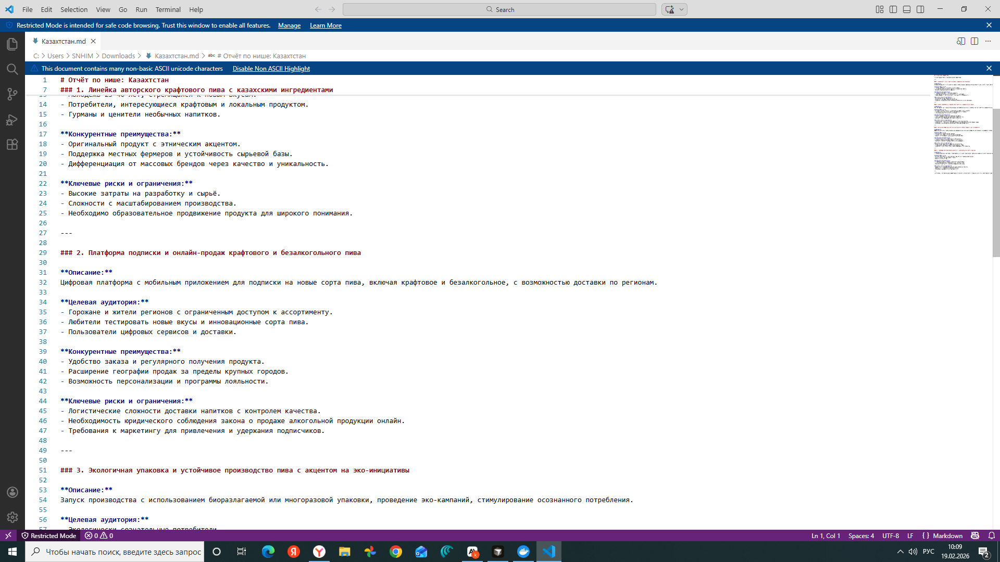

# ☁️ Business Ideas Generator — Облачная версия


> 🚀 AI-агент для исследования рынка и генерации бизнес-идей через облачный API. Быстро, качественно, масштабируемо!

Мини-приложение с псевдоагентом для исследования рынка и генерации бизнес-идей через **Proxy API** (совместимый с OpenAI).

---

## 📋 Содержание

- [Особенности](#-особенности)
- [Скриншоты](#-скриншоты)
- [Быстрый старт](#-быстрый-старт)
- [Установка](#-установка)
- [Использование](#-использование)
- [Примеры](#-примеры)
- [Сравнение версий](#-сравнение-облачная-vs-локальная)
- [Docker](#-docker)
- [Устранение проблем](#-устранение-проблем)
- [Roadmap](#️-roadmap)
- [Лицензия](#-лицензия)

---

## ✨ Особенности

- ☁️ **Облачная генерация** — использует мощные LLM через API (GPT-4, Claude и др.)
- ⚡ **Высокая скорость** — результат за 30-60 секунд
- 🎯 **Качественные идеи** — благодаря продвинутым моделям
- 🔄 **Пошаговый процесс** — визуализация каждого этапа исследования
- 📊 **Структурированный отчёт** — 3-5 бизнес-идей с анализом
- 📝 **Экспорт в Markdown** — скачивание результатов
- 🐳 **Docker Ready** — простое развертывание
- 🌐 **Proxy API** — работа через ProxyAPI.ru или любой OpenAI-совместимый сервис
- 🎨 **Современный UI** — чистый и интуитивный интерфейс

---

## 📸 Скриншоты

### Главная страница

*Форма ввода ниши и региона для исследования*

### Процесс генерации

*Пошаговая визуализация: анализ трендов, конкуренты, боли аудитории*

### Финальный отчёт

*Готовый отчёт с 3-5 идеями, целевой аудиторией и рисками*

---

## ⚡ Быстрый старт

### Через Docker (рекомендуется)

```bash
# 1. Клонируйте репозиторий
git clone https://github.com/ваш-username/business-ideas-generator-cloud.git
cd business-ideas-generator-cloud

# 2. Создайте .env файл
cp .env.example .env
# Отредактируйте .env и добавьте ваши ключи

# 3. Запустите через Docker
docker compose up --build

# 4. Откройте в браузере
# http://localhost:8000
```

### Без Docker

```bash
# 1. Установите зависимости
pip install -r requirements.txt

# 2. Настройте переменные окружения (Windows)
$env:PROXY_API_URL="https://api.proxyapi.ru/openai/v1"
$env:PROXY_API_KEY="sk-ваш-ключ"

# 3. Запустите backend
uvicorn backend.main:app --reload

# 4. Откройте http://localhost:8000
```

---

## 📦 Требования

### Системные
- **Python** 3.11 или выше
- **Docker** (опционально, но рекомендуется)
- **API ключ** от Proxy API или OpenAI

### Зависимости Python
```
fastapi==0.115.5
uvicorn[standard]==0.32.1
jinja2==3.1.4
python-multipart==0.0.17
openai==1.58.1
httpx==0.27.2
```

---

## 🔧 Установка

### Шаг 1: Получите API ключ

#### Вариант А: ProxyAPI.ru (рекомендуется для РФ)
1. Зарегистрируйтесь на [ProxyAPI.ru](https://proxyapi.ru)
2. Пополните баланс
3. Скопируйте API ключ

#### Вариант Б: OpenAI напрямую
1. Зарегистрируйтесь на [platform.openai.com](https://platform.openai.com)
2. Создайте API ключ
3. Добавьте платёжный метод

#### Вариант В: Другие Proxy провайдеры
Любой сервис с OpenAI-совместимым API:
- API.together.xyz
- Groq.com
- И другие

### Шаг 2: Настройка переменных окружения

Создайте файл `.env` в корне проекта:

```env
# Для ProxyAPI.ru
PROXY_API_URL=https://api.proxyapi.ru/openai/v1
PROXY_API_KEY=sk-ваш-ключ-здесь

# Для OpenAI напрямую
# PROXY_API_URL=https://api.openai.com/v1
# PROXY_API_KEY=sk-proj-ваш-openai-ключ
```

**⚠️ Важно:** 
- Никогда не коммитьте `.env` в Git!
- Используйте `.env.example` для шаблона

### Шаг 3: Установка зависимостей

```bash
# Создайте виртуальное окружение (рекомендуется)
python -m venv .venv

# Активируйте
# Windows:
.\.venv\Scripts\activate
# Linux/Mac:
source .venv/bin/activate

# Установите зависимости
pip install -r requirements.txt
```

---

## 🚀 Использование

### Запуск через Docker

```bash
# Сборка образа
docker compose build

# Запуск в фоновом режиме
docker compose up -d

# Просмотр логов
docker compose logs -f

# Остановка
docker compose down
```

После запуска:
- **Frontend:** http://localhost:8000
- **API:** http://localhost:8000/api/generate

### Запуск без Docker

```bash
# Windows PowerShell
$env:PROXY_API_URL="https://api.proxyapi.ru/openai/v1"
$env:PROXY_API_KEY="sk-ваш-ключ"
uvicorn backend.main:app --reload

# Linux/Mac
export PROXY_API_URL="https://api.proxyapi.ru/openai/v1"
export PROXY_API_KEY="sk-ваш-ключ"
uvicorn backend.main:app --reload
```

### Использование через интерфейс

1. Откройте http://localhost:8000
2. Введите **нишу/отрасль** (например, "кофейни")
3. Опционально укажите **регион** (например, "Москва")
4. Нажмите **"Исследовать рынок"**
5. Дождитесь результата (30-60 секунд)
6. Скачайте отчёт в Markdown формате

---

## 🔄 Сравнение: Облачная vs Локальная

| Критерий | ☁️ Облачная (VCc03) | 🏠 Локальная (VCd01) |
|----------|---------------------|----------------------|
| **Стоимость** | ⚠️ Платно (~$0.01-0.10 за запрос) | ✅ Бесплатно |
| **Интернет** | ❌ Требуется | ✅ Не требуется |
| **Приватность** | ⚠️ Данные через API | ✅ 100% локально |
| **Скорость** | ✅ 30-60 секунд | ⚠️ 1-3 минуты |
| **Качество** | ✅ Высокое (GPT-4) | ⚠️ Зависит от модели |
| **Установка** | ✅ Простая | ⚠️ Сложнее (Ollama) |
| **Масштабирование** | ✅ Легко | ❌ Ограничено железом |
| **Веб-поиск** | ✅ Возможен | ❌ Нет (в базовой версии) |

### 💡 Когда использовать облачную версию:

**✅ Используйте облачную (VCc03), если:**
- ⚡ Критична скорость генерации
- 🎯 Нужно максимальное качество идей
- 💼 Коммерческое использование
- 👥 Множество пользователей
- 🌐 Доступ из разных мест
- 💰 Готовы платить за качество

**❌ НЕ используйте облачную, если:**
- 🔒 Критична конфиденциальность
- 💸 Хотите избежать затрат
- 🌐 Нет стабильного интернета
- 🧪 Просто экспериментируете

🔗 **Локальная версия:** [business-ideas-generator-ollama](https://github.com/ваш-username/business-ideas-generator-ollama)

---

## 🐳 Docker

### Структура Docker Setup

```yaml
# docker-compose.yml
version: "3.9"

services:
  backend:
    build: .
    ports:
      - "8000:8000"
    env_file:
      - .env
    restart: unless-stopped
```

### Переменные окружения

Обязательные:
- `PROXY_API_URL` — URL Proxy API
- `PROXY_API_KEY` — Ваш API ключ

Опциональные:
- `LOG_LEVEL` — уровень логирования (default: INFO)
- `MAX_WORKERS` — кол-во воркеров (default: 1)

### Команды Docker

```bash
# Сборка
docker compose build

# Запуск
docker compose up

# Запуск в фоне
docker compose up -d

# Остановка
docker compose down

# Перезапуск
docker compose restart

# Просмотр логов
docker compose logs -f backend

# Пересборка без кеша
docker compose build --no-cache
```

---

## 🐛 Устранение проблем

### Ошибка: "API key is invalid"

**Причина:** Неправильный или истёкший API ключ.

**Решение:**
1. Проверьте баланс на ProxyAPI.ru
2. Убедитесь что ключ скопирован полностью
3. Проверьте файл `.env`:
   ```env
   PROXY_API_KEY=sk-правильный-ключ-без-пробелов
   ```
4. Перезапустите сервер

---

### Ошибка: "Connection timeout"

**Причина:** Нет связи с API или медленное соединение.

**Решение:**
1. Проверьте интернет-соединение
2. Попробуйте другой Proxy URL:
   ```env
   PROXY_API_URL=https://api.openai.com/v1
   ```
3. Проверьте firewall и VPN

---

### Ошибка: "Rate limit exceeded"

**Причина:** Превышен лимит запросов к API.

**Решение:**
1. Дождитесь сброса лимита (обычно 1 минута)
2. Перейдите на план с большими лимитами
3. Используйте другой API ключ

---

### Frontend не открывается

**Решение:**

```bash
# Проверьте что backend запущен
curl http://localhost:8000/health

# Проверьте логи
docker compose logs backend

# Убедитесь что порт 8000 свободен
netstat -ano | findstr :8000  # Windows
lsof -i :8000                 # Linux/Mac
```

---

### Docker не собирается

**Решение:**

```bash
# Очистите кеш Docker
docker system prune -a

# Пересоберите без кеша
docker compose build --no-cache

# Проверьте версию Docker
docker --version  # Должна быть 20.10+
```

---

## 🗺️ Roadmap

### ✅ Версия 1.0 (Текущая)
- [x] Базовый генератор через Proxy API
- [x] Пошаговая визуализация
- [x] Экспорт в Markdown
- [x] Docker поддержка
- [x] Современный UI

### 🚧 Версия 1.1 (В разработке)
- [ ] Множественные API провайдеры (OpenAI, Anthropic, etc.)
- [ ] Выбор модели через интерфейс (GPT-4, GPT-3.5)
- [ ] Сохранение истории исследований
- [ ] Экспорт в PDF/DOCX
- [ ] Темная/светлая тема

### 📅 Версия 1.2 (Планируется)
- [ ] Веб-поиск для актуальных данных
- [ ] Сравнение нескольких ниш
- [ ] Расширенная аналитика (графики, диаграммы)
- [ ] Collaborative mode (для команд)
- [ ] Webhook интеграции
- [ ] REST API для внешних приложений

### 🔮 Версия 2.0 (Будущее)
- [ ] Multi-agent система с специализацией
- [ ] Интеграция с CRM системами
- [ ] AI-визуализация идей (майндмэпы)
- [ ] Telegram/Discord боты
- [ ] Mobile приложение (React Native)
- [ ] Blockchain для верификации идей (?)

---

## 🤝 Участие в проекте

Буду рад вашим улучшениям!

### Как внести вклад

1. Fork проекта
2. Создайте feature branch: `git checkout -b feature/AmazingFeature`
3. Commit: `git commit -m 'feat: добавлена крутая фича'`
4. Push: `git push origin feature/AmazingFeature`
5. Откройте Pull Request

### Что можно улучшить

**🎨 UI/UX:**
- Новые темы оформления
- Адаптация под мобильные
- Анимации и переходы

**🔧 Функциональность:**
- Поддержка новых API провайдеров
- Новые форматы экспорта
- Интеграции с внешними сервисами

**📚 Документация:**
- Больше примеров использования
- Видео-туториалы
- Переводы на другие языки

---

## 📊 Стоимость использования

### Приблизительная стоимость через ProxyAPI:

| Действие | Токены | Стоимость (₽) |
|----------|--------|---------------|
| 1 генерация (GPT-4o-mini) | ~3000 | ~0.50₽ |
| 1 генерация (GPT-4) | ~3000 | ~5.00₽ |
| 100 генераций (GPT-4o-mini) | ~300k | ~50₽ |

**💡 Совет:** Используйте GPT-4o-mini для экспериментов, GPT-4 для продакшена.

---

## 📄 Лицензия

Этот проект распространяется под **лицензией MIT**. См. файл [LICENSE](LICENSE) для деталей.

Вкратце: вы можете свободно использовать, изменять и распространять этот код, даже в коммерческих целях, при условии сохранения копирайта.

---

## 🌟 Благодарности

- **[FastAPI](https://fastapi.tiangolo.com/)** — за быстрый и простой фреймворк
- **[OpenAI](https://openai.com/)** — за API и мощные модели
- **[ProxyAPI.ru](https://proxyapi.ru)** — за доступ к OpenAI из России
- **Сообщество** — за feedback и предложения

---

## 📞 Контакты и поддержка

- 🐛 **Баги:** [Issues](https://github.com/ваш-username/business-ideas-generator-cloud/issues)
- 💡 **Предложения:** [Discussions](https://github.com/ваш-username/business-ideas-generator-cloud/discussions)
- 📧 **Email:** your.email@example.com
- 💬 **Telegram:** @yourusername

---

## ☕ Поддержать проект

Если проект оказался полезным:

- ⭐ **Звезда на GitHub** — лучшая мотивация!
- 💰 [Buy Me a Coffee](https://buymeacoffee.com/yourname)
- 🪙 [Boosty](https://boosty.to/yourname)

---

<div align="center">

**Сделано с ❤️ для предпринимателей и стартаперов**

⭐ Поставьте звезду, если проект был полезен!

[🏠 Локальная версия](https://github.com/ваш-username/business-ideas-generator-ollama) | [☁️ Облачная версия](https://github.com/ваш-username/business-ideas-generator-cloud)

</div>

